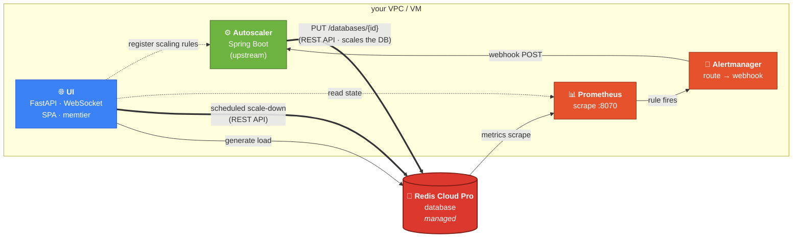

<div align="center">

# Redis Cloud Autoscaler — Web UI

**A plug-and-play orchestration + dashboard layer around the official Redis Cloud Autoscaler.**
One `docker compose up -d` away from watching your Redis Cloud Pro database elastically scale, end to end.

[](LICENSE)
[](https://hub.docker.com/r/gacerioni/redis-cloud-autoscaler-ui)
[](https://hub.docker.com/r/gacerioni/redis-cloud-autoscaler-ui/tags)
[](https://hub.docker.com/r/gacerioni/redis-cloud-autoscaler-ui/tags)
[](.github/workflows/ci.yml)

[Quickstart](#-five-minute-quickstart) ·
[Architecture](#%EF%B8%8F-architecture) ·
[Configuration](#-configuration) ·
[Security](#-security--defaults) ·
[Tutorial 🇧🇷](TUTORIAL.pt-BR.md)

</div>

---

## What this is

The [**Redis Cloud Autoscaler**](https://github.com/redis-field-engineering/redis-cloud-autoscaler)
is a Spring Boot service maintained by Redis Field Engineering. It listens for
Prometheus alerts and calls the Redis Cloud REST API to scale databases.
**Powerful, production-grade, but bring-your-own-everything**: you have to
stand up Prometheus, Alertmanager, write the alert rules, register the
scaling rules, and build a UI if you want one.

This repository **wraps that autoscaler in a self-contained demo stack** so
you can show it working in under five minutes — to customers, to your team,
or to yourself.

| | Upstream autoscaler (alone) | This repo |
|---|---|---|
| Java Spring Boot service | ✅ | ✅ *(used as-is, unchanged)* |
| Prometheus + scrape config | bring-your-own | **auto-rendered from `.env`** |
| Alertmanager + routes | bring-your-own | **auto-rendered from `.env`** |
| Alert rules (`IncreaseThroughput` …) | hand-written | **derived from thresholds in `.env`** |
| Scaling rule registration | hand-curled into the API | **idempotent on every boot** |
| Discovery of the internal Prometheus endpoint | manual lookup | **auto-discovered from the subscription** |
| Web dashboard | — | ✅ FastAPI + WebSocket + Chart.js SPA |
| Load generator | — | ✅ `memtier_benchmark` shipped inside the image |
| Scheduled scale-down | — | ✅ backend timer + Redis Cloud REST API |
| Safe `FLUSHDB` (preserves autoscaler metadata) | — | ✅ |
| HTTP Basic Auth + WebSocket auth | — | ✅ optional, single env var |
| HTTPS via Caddy (Let's Encrypt) | — | ✅ opt-in overlay |
| Multi-arch image (`amd64` + `arm64`) | — | ✅ |

> 📌 **Status:** demo / educational. The upstream autoscaler is field-supported software with production customers; **this repository is the presentation + plug-and-play layer around it**, not an officially supported Redis product.

---

## ⚡ Five-minute quickstart

You need: **Docker**, **Docker Compose v2** (`docker compose`, not the legacy
`docker-compose` v1 from `apt` — the stack uses
`depends_on: condition: service_completed_successfully`, which only v2 supports.
See [Compose v2 install snippet](TUTORIAL.pt-BR.md#instalando-docker-compose-v2)
if you don't have it), a **Redis Cloud Pro** subscription with API keys and a
database, and **network reachability** from this host to the database's
private endpoint (PSC, VPC peering, Transit Gateway, …).

```bash
git clone https://github.com/Redislabs-Solution-Architects/redis-cloud-autoscaler-ui.git
cd redis-cloud-autoscaler-ui
cp .env.example .env
$EDITOR .env                   # fill in TIER 1 (see below)
docker compose pull            # always grab the latest UI image first
docker compose up -d
open http://localhost:8000     # the UI
```

> **Re-deploying on a host that ran an older version?** Run `docker compose pull`
> first. `docker compose up -d` reuses a cached `latest` image and will silently
> keep running old code otherwise.

That's it. The stack:

1. **Renders Prometheus + alert rules** from your `.env` (Alpine init container, runs once).
2. **Auto-discovers** the internal Prometheus scrape endpoint from your subscription.
3. **Starts** Prometheus, Alertmanager, the upstream Autoscaler, and this UI.
4. **Registers** the scaling rule with the Autoscaler — idempotently.
5. **Streams live state** to your browser over WebSocket.

### Required `.env` fields

Fill **TIER 1** in [`.env.example`](.env.example). Six connection values + four sizing values — nothing else is required to start.

| Variable | Where to find it |
|---|---|
| `REDIS_HOST_AND_PORT` | Console → your database → *Configuration* → private endpoint |
| `REDIS_PASSWORD` | Console → your database → *Security* |
| `REDIS_CLOUD_ACCOUNT_KEY` | Console → *Access Management* → API Keys → **Account key** (public) |
| `REDIS_CLOUD_API_KEY` | same screen → **User key** (secret) — its owner needs the **Owner** role, see [API permissions](#-redis-cloud-api-permissions) |
| `REDIS_CLOUD_SUBSCRIPTION_ID` + `REDIS_CLOUD_DATABASE_ID` | numeric IDs from the console URLs |
| `BASELINE_OPS` · `BASELINE_MEM_GB` · `BURST_OPS` · `THROUGHPUT_CEILING` | size to **your** DB — see [Running against YOUR account](#running-against-your-redis-cloud-account) |

You do **not** set the metrics endpoint — its host is auto-discovered from the subscription with the same credentials, and the port defaults to the standard `8070`. Everything else (thresholds, branding, scale-down, auth) has sensible defaults. Advanced overrides (metrics host/port, REST API version, internal URLs) live in TIER 3 of `.env.example` and are rarely touched.

> `REDIS_CLOUD_DATABASE_ID` was previously `DEMO_DB_ID`; the old name still works.

### Running against YOUR Redis Cloud account

The stack is account-agnostic — the six connection fields above come from *your*
console, whatever the account, subscription, or database. But four more
values **must be sized to your database**, because the defaults describe a
demo environment, not yours:

```bash
BASELINE_OPS=25000        # ← the throughput YOUR DB is configured for today
BASELINE_MEM_GB=2.5       # ← YOUR dataset size as shown in the console
BURST_OPS=40000           # ← the throughput a scale-up jumps to (cost impact!)
THROUGHPUT_CEILING=40000  # ← hard cap — the autoscaler never goes beyond this
```

Get `BASELINE_OPS` wrong and the alert threshold fires at the wrong level
(the UI warns at boot when it detects the mismatch). `BURST_OPS` and
`THROUGHPUT_CEILING` are *what you are willing to pay for* when a spike
hits — size them deliberately before the first run.

### Building from source / private registries (Artifactory, ECR, GAR, …)

If your pipeline must build images internally instead of pulling from
Docker Hub:

```bash
docker build -t registry.your-company.com/redis-cloud-autoscaler-ui:1.0 .
docker push registry.your-company.com/redis-cloud-autoscaler-ui:1.0

# then point the stack at it — in .env:
UI_IMAGE=registry.your-company.com/redis-cloud-autoscaler-ui:1.0
```

The build is fully self-contained: `memtier_benchmark` is compiled from a
pinned upstream release *during* the build, and nothing is fetched from
this repo's authors at runtime. The other four images (Prometheus,
Alertmanager, the upstream autoscaler, Alpine) can be mirrored into your
registry and overridden the same way if needed — they are referenced once
each in [`docker-compose.yml`](docker-compose.yml).

> 🇧🇷 **Tutorial em português** com passo a passo, screenshots e troubleshooting: [`TUTORIAL.pt-BR.md`](TUTORIAL.pt-BR.md)

---

## 🏗️ Architecture



**The thick lines (`==>`) are write operations on your Redis Cloud DB**: the autoscaler scales it up reactively, and the UI's scheduled-reset timer scales it back down on its own clock.

### What runs

| Container | Image | Lifecycle | Why |
|---|---|---|---|
| `init-config` | `alpine:3.20` | one-shot | renders Prometheus templates + auto-discovers metrics endpoint, then exits |
| `autoscaler` | `ghcr.io/redis-field-engineering/redis-cloud-autoscaler` | long-running | the unchanged upstream service |
| `prometheus` | `prom/prometheus` | long-running | scrapes `bdb_*` metrics from the DB's `:8070` endpoint |
| `alertmanager` | `prom/alertmanager` | long-running | routes `IncreaseThroughput` (and optionally `IncreaseMemory`) webhooks |
| `ui` | `gacerioni/redis-cloud-autoscaler-ui` | long-running | this repo — FastAPI + Chart.js dashboard, load generator, admin actions |

**Only the UI (`:8000`) is published to the host by default.** Prometheus / Alertmanager / Autoscaler stay on the internal compose network. To inspect them directly, opt-in:

```bash
docker compose -f docker-compose.yml -f docker-compose.expose.yml up -d
```

---

## 🔧 Configuration

Everything is in [`.env`](.env.example). Quick map:

```bash
# WHEN to scale (thresholds + debounce)
THROUGHPUT_THRESHOLD_PCT=80       # of BASELINE_OPS
THROUGHPUT_THRESHOLD_FOR=30s
MEMORY_THRESHOLD_PCT=80           # only used if MEMORY_SCALING_ENABLED=true
MEMORY_THRESHOLD_FOR=30s

# HOW MUCH to scale (targets + hard caps)
BASELINE_OPS=25000
BURST_OPS=40000                   # IncreaseThroughput → jumps to this
THROUGHPUT_CEILING=40000          # never beyond this
BASELINE_MEM_GB=2.5
MEMORY_STEP_GB=2                  # +N GB per memory trigger
MEMORY_CEILING_GB=5

# Scheduled scale-down — OFF by default (production-safe)
AUTO_RESET_ENABLED=false          # true = opt in to the demo auto-scale-down
AUTO_RESET_SECONDS=300            # if enabled: back to baseline N seconds after a scale-up
```

**Production (default):** the DB scales up and *stays* up — no automatic
scale-down — until you click **Reset now** (or `POST /api/admin/reset-baseline`).
This is on purpose: the autoscaler reacts to real traffic, and a timer that
pulled the DB back to baseline mid-event would fight it (yo-yo).

**Repeatable demos:** set `AUTO_RESET_ENABLED=true` so the DB auto-returns to
baseline `AUTO_RESET_SECONDS` after each scale-up.

Change anything, then:

```bash
docker compose down && docker compose up -d
```

Five seconds later the new policy is live — the init container re-renders the
Prometheus rules and the UI re-registers the scaling rules with the autoscaler.

### Per-customer demo branding

```bash
DEMO_CLIENT_NAME="Customer Inc."
DEMO_TAGLINE="Black Friday peak traffic"
```

These show up in the dashboard header.

---

## 🛡️ Security & defaults

| Default | Why |
|---|---|
| **HTTP Basic Auth** off (`UI_AUTH_PASSWORD=`) | open access for quick demos; set any non-empty value to enable. Browser prompts the first time; the WebSocket upgrade carries the same credentials. |
| **Memory scaling** off (`MEMORY_SCALING_ENABLED=false`) | scaling memory has direct cost impact. The dashboard still shows live memory usage as context, but no `IncreaseMemory` alert/rule is created. |
| **Throughput cap** at `40 000 ops/sec` | covers typical event-driven peaks (live sports / live streaming / voting events around 30 k ops/sec) with headroom, while preventing runaway scale. |
| **Internal ports** unpublished | only `:8000` (UI) is on the host. Prometheus/Alertmanager/Autoscaler are reachable only from inside the compose network. |
| **Automatic scale-down** off (`AUTO_RESET_ENABLED=false`) | production-safe default: the DB holds its scaled capacity until a manual reset. Reactive/timed scale-down yo-yos against the autoscaler on real traffic. Set `true` only for repeatable demos. |

---

## 🔑 Redis Cloud API permissions

For the autoscaler to actually scale your database, the REST API credentials must be allowed to **modify** subscriptions/databases — not just read them.

1. **Enable the API** at the account level: Console → *Access Management* → *API Keys* → **Enable API**. This is an account-**Owner**-only action and produces the **Account key** (your `REDIS_CLOUD_ACCOUNT_KEY`, sent as `x-api-key`).
2. **Create a User key** (your `REDIS_CLOUD_API_KEY`, sent as `x-api-secret-key`) whose owner has the **Owner** role.

| Role of the User key's owner | Can scale via API? |
|---|---|
| **Owner** | ✅ yes — read + write across subscriptions/databases |
| Viewer / Logs Viewer | ❌ read-only |
| Billing Admin | ❌ billing endpoints only |
| Manager / Member | ❌ can edit in the web console, but **cannot hold an API key** at all |

If the role is insufficient, the scale call fails with **HTTP 403** (`not allowed…`); wrong or swapped keys fail with **HTTP 401**. The UI's *Reset now* surfaces these with a hint. Docs: [Access management](https://redis.io/docs/latest/operate/rc/security/access-control/access-management/) · [Manage API keys](https://redis.io/docs/latest/operate/rc/api/get-started/manage-api-keys/).

---

## 🌐 Public deployment with HTTPS

For a public URL with automatic Let's Encrypt certs (via [Caddy](https://caddyserver.com/)):

```bash
# 1. point a DNS A/AAAA at this host
# 2. open :80 and :443
# 3. in .env:
DEMO_DOMAIN=autoscaler.yourdomain.com
DEMO_EMAIL=ops@yourdomain.com
# 4. bring up with the overlay:
docker compose -f docker-compose.yml -f docker-compose.public.yml up -d
```

Caddy fetches and renews the certificate automatically. No certbot, no cron.

---

## 📁 Repo layout

```
.
├── docker-compose.yml            full stack (default — only UI exposed)
├── docker-compose.public.yml     overlay · Caddy + Let's Encrypt
├── docker-compose.expose.yml     overlay · publish internal ports (debug)
├── Dockerfile                    multi-stage · memtier source build + slim runtime
├── .env.example                  every knob, documented
│
├── app/                          this repo's contribution
│   ├── main.py                   FastAPI + WebSocket + Basic Auth middleware
│   ├── bootstrap.py              boot: validate config + register scaling rules
│   ├── config.py                 typed env-var settings
│   ├── state.py                  background fetcher + auto-reset scheduler
│   ├── memtier.py                memtier_benchmark subprocess controller
│   ├── admin.py                  safe FLUSHDB · force-reset · reload-rules
│   └── static/                   HTML · CSS · vanilla JS · Chart.js · logos
│
├── prometheus/                   templates (rendered into a shared volume at boot)
│   ├── prometheus.template.yml
│   ├── alert.rules.template               IncreaseThroughput (always)
│   ├── alert.rules.memory.template        IncreaseMemory (only if enabled)
│   └── alertmanager.yml
│
├── deploy/caddy/Caddyfile        5-line TLS config
└── .github/workflows/ci.yml      Python syntax + compose validation + multi-arch build
```

---

## 🩹 Troubleshooting

| Symptom | Action |
|---|---|
| `Container … exited with code 5` (prometheus / alertmanager) | You're on `docker-compose` v1 — install Compose v2, then `docker compose down -v && docker compose up -d` |
| UI crash-loops with `Missing required env var: DEMO_DB_ID`, or behaves like an older version | Stale cached `latest` image — `docker compose pull && docker compose up -d ui` |
| `autoscaler-init` fails (non-zero exit) | `docker logs autoscaler-init` — it prints exactly which check failed (key shape, HTTP code from the REST API, etc) |
| **`REST API returned HTTP 500`** in the init logs | `REDIS_CLOUD_API_KEY` ⇄ `REDIS_CLOUD_ACCOUNT_KEY` swapped *(they map to `x-api-secret-key` / `x-api-key` respectively)* |
| **`looks malformed … (contains space / # / quote)`** in init logs | Inline `# comment` or quotes leaked into a value in `.env`. Move comments above the variables, no quotes on values. |
| **`HTTP 403`** when scaling (or *Reset now* says "lacks permission") | The User key's owner isn't **Owner** — see [API permissions](#-redis-cloud-api-permissions). Viewer/Logs Viewer can't scale. |
| UI says `connecting…` forever | `docker compose logs ui` — check for bootstrap errors |
| Prometheus target `rediscloud` red | network can't reach `<endpoint>:<metrics-port>` — fix PSC / VPC peering before retrying |
| Autoscaler not reacting to alerts | Open the **Admin** panel → *Reload rules*. Confirm `docker compose logs autoscaler` shows `Received alert` |
| DB scales up but never comes back down | Expected if `AUTO_RESET_ENABLED=false` (suspended). Use **Reset now**, or set it back to `true` and recreate the UI container. |
| `Database size is smaller than usage` when downsizing | Admin → *FLUSHDB* (safe — preserves the autoscaler's metadata) before reducing memory |
| Want to inspect Prometheus directly | use the `docker-compose.expose.yml` overlay |

---

## 🔗 References

- [**redis-field-engineering/redis-cloud-autoscaler**](https://github.com/redis-field-engineering/redis-cloud-autoscaler) — the upstream Java service this repo wraps
- [Redis Cloud REST API](https://api.redislabs.com/v1/swagger-ui/index.html)
- [memtier_benchmark](https://github.com/RedisLabs/memtier_benchmark) — the load generator we ship inside the UI image
- [Prometheus](https://prometheus.io/) · [Alertmanager](https://prometheus.io/docs/alerting/latest/alertmanager/) · [Caddy](https://caddyserver.com/)

---

<div align="center">
<sub>MIT-licensed. Built for Redis Field Engineering / Solutions Architects demos.<br/>
Maintained by <a href="https://github.com/gacerioni">@gacerioni</a> · PRs welcome.</sub>
</div>
